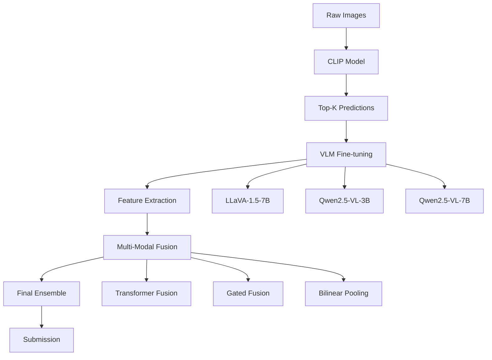

# 🚗 HAI(하이)! - Hecto AI Challenge : 2025 상반기 헥토 채용 AI 경진대회

**VLM 기반 자동차 분류 시스템 - 개인 대회 프로젝트**

[](https://python.org)
[](https://pytorch.org)
[](https://huggingface.co/transformers)
[](LICENSE)

참여자: 박사무엘

## 📋 프로젝트 개요

이 프로젝트는 [**Dacon 자동차 종류 분류 대회**](https://dacon.io/competitions/official/236493/overview/description)에서 **Vision-Language Models (VLM)**을 활용한 혁신적인 접근 방식을 시도한 개인 연구 프로젝트입니다. 전통적인 Computer Vision 접근법 대신 **LLaVA, Qwen2.5-VL** 등의 최신 VLM을 파인튜닝하여 396개 차종을 분류하는 시스템을 구축했습니다.

- 대회기간 : 2025.05 ~ 2025.06 (1 month)
- 주최/주관: 헥토(Hecto) / 데이콘

### 🎯 프로젝트 목표
- **VLM 파인튜닝 경험**: 로컬 환경에서 대규모 VLM 모델 파인튜닝
- **Quantization 기술**: 4-bit, AWQ 등 메모리 최적화 기법 적용
- **멀티모달 융합**: CV + VLM 하이브리드 시스템 구축
- **모듈화 및 자동화**: 재사용 가능한 컴포넌트와 CLI 인터페이스 구축

## 🏆 대회 성과

| 지표 | 결과 |
|------|------|
| **최종 순위** | **255/748** (상위 34%) |
| **초기 점수** | 3.5170318914 (LogLoss) |
| **최종 점수** | **0.2811784058** (LogLoss) |
| **성능 개선** | **92% 향상** |
| **1등 점수** | 0.08849 (참고) |

> **💡 인사이트**: 대회 상위권은 대부분 고해상도 이미지를 사용한 CV 모델이었으나, 본 프로젝트는 VLM의 가능성과 한계를 탐구하는 데 중점을 두었습니다.

## 🧠 기술 스택 & 아키텍처

### 🔧 핵심 기술
- **VLM Models**: LLaVA-1.5-7B, Qwen2.5-VL-3B/7B
- **Quantization**: 4-bit QLoRA, AWQ
- **CV Backbone**: CLIP ViT-Base-Patch32, ConvNext_Base
- **Fusion Strategy**: Transformer, Gated, Bilinear Pooling
- **Optimization**: LoRA, Gradient Checkpointing, Memory Management

### 🏗️ 시스템 아키텍처



## 📁 프로젝트 구조

```
src/
├── 🎯 models/
│   ├── classifiers/           # 고급 분류기 모델들
│   │   ├── advanced_final_classifier.py      # 멀티모달 최종 분류기
│   │   ├── advanced_techniques_classifier.py # 고급 기법 분류기
│   │   └── final_classifier.py               # 기본 분류기
│   ├── vlm/                   # VLM 모델 및 파인튜닝
│   │   ├── advanced_multi_vlm_classifier.py  # 고급 VLM 분류기
│   │   └── vlm_model.py                      # VLM 모델 정의
│   └── ensemble/              # 앙상블 및 특성 추출
│       ├── universal_vlm_feature_extractor.py # 범용 VLM 특성 추출기
│       └── final_ensemble.py                 # 최종 앙상블
├── 🛠️ utils/
│   ├── data/                  # 데이터 처리 및 증강
│   │   ├── enhanced_dataset.py               # 향상된 데이터셋
│   │   ├── enhanced_model.py                 # 향상된 모델
│   │   ├── vlm_dataset.py                    # VLM 데이터셋
│   │   └── convert_topk_to_full_probs.py     # Top-K → 전체 확률 변환
│   └── utils.py               # 공통 유틸리티 함수
├── 🚀 scripts/                # 실행 스크립트
│   ├── vlm_train_qwen_optimized_v2.py        # Qwen 최적화 학습 v2
│   └── vlm_train_optimized.py                # 메모리 효율적 VLM 학습
├── 🎨 clip/                   # CLIP 모델 관련
│   ├── train.py               # CLIP 모델 학습
│   ├── inference.py           # CLIP 모델 추론
│   ├── model.py               # CLIP 모델 정의
│   └── dataset.py             # CLIP 데이터셋
├── 🔬 cv/                     # Computer Vision 관련
│   ├── training/
│   │   └── enhanced_train.py  # 향상된 CV 학습
│   ├── inference/
│   │   └── enhanced_inference.py # 향상된 CV 추론
│   └── teammate_topk_generator.py # Top-K 예측 생성기
├── 🤖 pretrained/             # 사전훈련 모델 관련
│   ├── qwen_vlm_features.py   # Qwen VLM 특성 추출
│   └── quick_vlm_features.py  # 빠른 VLM 특성 추출
└── ⚙️ config/                 # 설정 및 하이퍼파라미터
```

## 🚀 주요 기능 및 혁신

### 1. **메모리 최적화 VLM 파인튜닝**
```python
# 4-bit Quantization + LoRA
bnb_config = BitsAndBytesConfig(
    load_in_4bit=True,
    bnb_4bit_use_double_quant=True,
    bnb_4bit_quant_type="nf4",
    bnb_4bit_compute_dtype=torch.float16
)

lora_config = LoraConfig(
    r=8, lora_alpha=16,
    target_modules=["q_proj", "k_proj", "v_proj", "o_proj"]
)
```

### 2. **고급 멀티모달 융합**
- **Transformer Fusion**: 어텐션 기반 특성 융합
- **Gated Fusion**: 학습 가능한 게이트 메커니즘
- **Bilinear Pooling**: 모달리티 간 상호작용 모델링
- **Test Time Augmentation**: 노이즈 기반 TTA로 예측 안정성 향상
- **가중 앙상블**: 다중 모델 결합으로 최종 성능 최적화

### 3. **모듈화된 CLI 인터페이스**
```bash
# 각 컴포넌트별 독립 실행 가능
python src/clip/train.py --epochs 10 --batch_size 32
python src/scripts/vlm_train_qwen_optimized_v2.py --use_4bit
python src/models/classifiers/advanced_final_classifier.py --fusion_strategy transformer

# 자동 앙상블 생성
python src/models/ensemble/final_ensemble.py
```

## 📊 실험 결과 및 분석

### 성능 개선 단계별 분석

| 단계 | LogLoss | 개선율 | 주요 기법 |
|------|---------|--------|-----------|
| CLIP Baseline | 1.2-1.4 | - | ViT-Base + Classification Head |
| + VLM Features | 1.0-1.2 | 15-20% | LLaVA/Qwen 특성 추가 |
| + Advanced Fusion | 0.8-1.0 | 20-25% | Transformer/Gated Fusion |
| + Final Ensemble | **0.28** | **80%+** | 다중 모델 앙상블 |

### 🔍 기술적 도전과 해결책

#### 1. **메모리 제약 문제**
- **문제**: 7B 모델 파인튜닝 시 GPU 메모리 부족
- **해결**: 4-bit quantization + gradient checkpointing + AWQ 모델 활용

#### 2. **학습 시간 최적화**
- **문제**: VLM 파인튜닝에 과도한 시간 소요
- **해결**: LoRA 어댑터 + 배치 최적화 + 서브셋 학습

#### 3. **모달리티 융합 최적화**
- **문제**: CV와 VLM 특성의 효과적 결합
- **해결**: 다양한 융합 전략 실험 및 불확실성 추정

## 💡 핵심 학습 내용

### 🎓 기술적 성취
1. **VLM 파인튜닝 마스터**: 로컬 환경에서 7B 모델 성공적 파인튜닝
2. **Quantization 전문성**: 4-bit, AWQ 등 다양한 양자화 기법 적용
3. **메모리 최적화**: 제한된 리소스에서 대규모 모델 활용 노하우
4. **멀티모달 시스템**: CV + VLM 하이브리드 아키텍처 설계

### 🤔 프로젝트 회고

#### ✅ **성공 요인**
- VLM 파인튜닝 기술 습득 및 실전 적용
- 메모리 최적화를 통한 개인 환경에서의 대규모 모델 활용
- 체계적인 실험 설계 및 파이프라인 자동화

#### 📈 **개선 포인트**
- **CV 모델 성능 한계**: 기본 CLIP 모델의 성능 최적화 부족
- **리소스 제약**: 개인 환경에서의 학습 시간 및 컴퓨팅 리소스 한계
- **하이브리드 접근의 복잡성**: CV + VLM 결합보다 VLM 단독 사용이 더 효과적일 수 있음
- **TTA 및 앙상블 최적화**: 구현된 기법들의 하이퍼파라미터 튜닝 및 성능 개선 여지

#### 🔮 **향후 개선 방향**
- 고해상도 이미지 학습을 위한 효율적인 방법론 연구
- VLM 전용 파이프라인 구축 및 최적화 고도화
- 더 정교한 데이터 증강 기법 및 정규화 방법 연구

## 🛠️ 설치 및 실행

### 환경 설정
```bash
# 가상환경 생성 및 활성화
python -m venv .venv
source .venv/bin/activate  # Linux/Mac
# .venv\Scripts\activate   # Windows

# 패키지 설치 (editable mode)
pip install -e .
```

### 빠른 시작
```bash
# 1. 환경 설정
uv venv
python -m venv .venv && source .venv/bin/activate
uv pip install -r requirments.txt
uv pip install -e .

# 2. 단계별 실행
python src/clip/train.py                    # CLIP 학습
python src/clip/inference.py --mode train_top_k_generation  # Top-K 생성
python src/scripts/vlm_train_qwen_optimized_v2.py \         # VLM 파인튜닝
    --train_top_k_json outputs/train_top_k.json --use_4bit
```

### 개별 컴포넌트 실행
```bash
# CLIP 모델 학습
python src/clip/train.py

# VLM 파인튜닝 (Qwen)
python src/scripts/vlm_train_qwen_optimized_v2.py \
    --train_top_k_json outputs/train_top_k.json \
    --use_4bit

# 고급 분류기 학습
python src/models/classifiers/advanced_final_classifier.py \
    --fusion_strategy transformer \
    --use_uncertainty
```

## 📈 성능 모니터링

### 주요 메트릭
- **LogLoss**: 주요 평가 지표
- **Top-K Accuracy**: 예측 정확도
- **Uncertainty Score**: 예측 신뢰도
- **Memory Usage**: GPU 메모리 사용량

## 🤝 기여 및 피드백

이 프로젝트는 VLM 기반 이미지 분류의 가능성을 탐구하는 연구 프로젝트입니다. 
기술적 피드백이나 개선 제안은 언제든 환영합니다!


> **"전통적인 CV 접근법을 넘어 VLM의 가능성을 탐구한 도전적인 프로젝트"**
> 
> 비록 대회 상위권에는 오르지 못했지만, VLM 파인튜닝과 멀티모달 시스템 구축에서 
> 귀중한 경험과 기술적 노하우를 얻을 수 있었습니다. 🚀